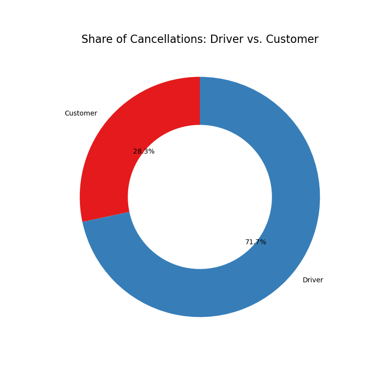
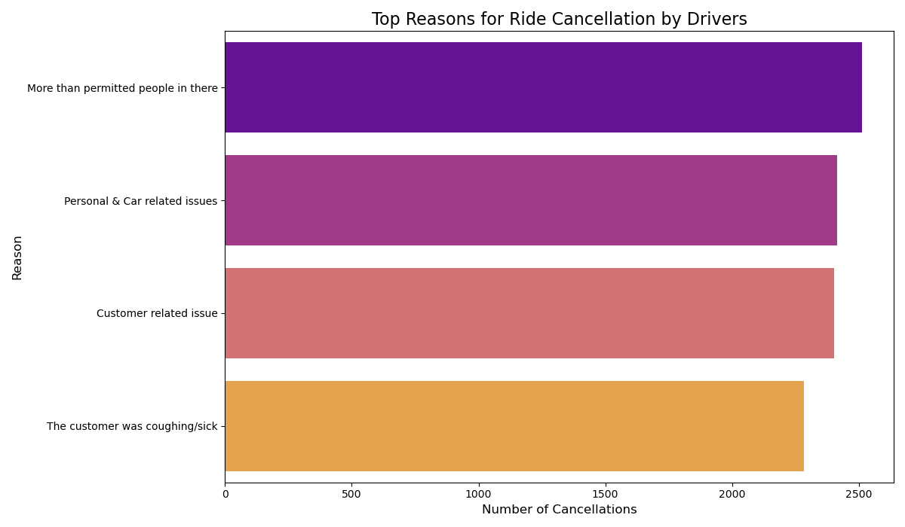

# Ola Ride-Hailing Service: Cancellation Analysis

## Project Overview

This project analyzes a dataset of over 50,000 Ola ride-hailing records to identify key trends in booking statuses, uncover the root causes of ride cancellations, and provide data-driven recommendations to improve service reliability and customer satisfaction.

## Key Questions Answered

1.  What is the overall distribution of successful, cancelled, and incomplete rides?
2.  Who cancels more: customers or drivers?
3.  What are the primary reasons drivers and customers cancel rides?
4.  Which vehicle types are most popular, and which are most valuable?
5.  What is the ride demand pattern throughout the week?

## Tools and Libraries

*   **Data Manipulation:** Pandas
*   **Data Visualization:** Matplotlib, Seaborn
*   **Programming Language:** Python
*   **Environment:** Jupyter Notebook

## Key Findings & Visualizations

### 1. High Rate of Driver-Initiated Cancellations
A significant portion of rides fail to complete, with driver cancellations being the primary cause.

### 2. "Driver Asked to Cancel" is a Major Issue
Analysis of cancellation reasons shows that a key pain point is drivers instructing customers to cancel, suggesting issues with driver incentives or ride assignments.

## Actionable Recommendations

1.  **Implement a Granular Cancellation Feedback System:** Replace vague cancellation reasons with a detailed checklist to gather more specific data.
2.  **Investigate High-Frequency Cancellations:** Flag drivers who frequently use ambiguous cancellation reasons and follow up with customers to verify.
3.  **Launch a "Successful Ride Bonus" Program:** Shift from penalizing cancellations to rewarding high completion rates to better align driver incentives with business goals.

